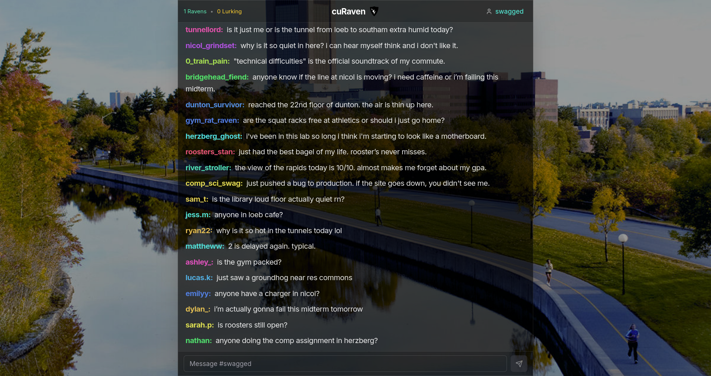

# cuRaven

A live chat for Carleton University. Anyone can watch the conversation but only students with a valid Carleton email can post.

## How to use

Sign in with your Carleton email to post messages. No account is needed to read the chat.

## How it works

Messages send and appear through WebSockets. This makes new messages appear instantly for all users. Chat history saves in Supabase. 

## License

This project uses the GPL-3.0 license. See the [LICENSE.md](LICENSE.md) file for details.